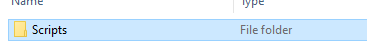
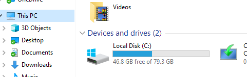
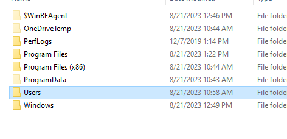
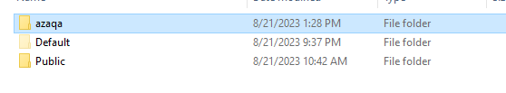
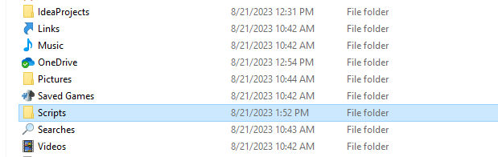
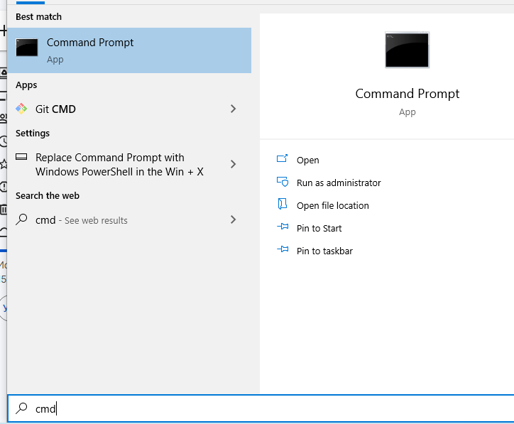
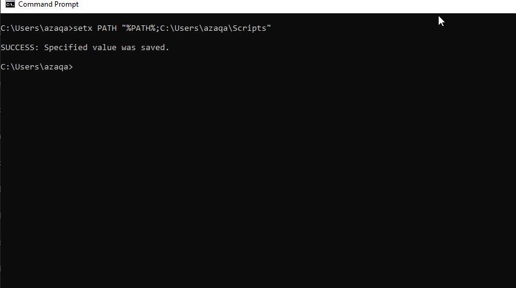
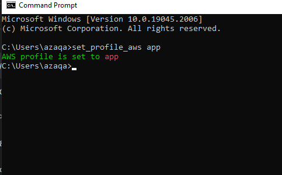
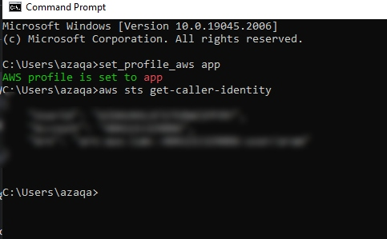

# AWS Set Profile Windows script

## Configuration

### First step need to clone repository or download that file [Click for download](https://drive.google.com/file/d/1mA4H08-zVM9D8ZQID64-ACCl0FaZGfTb/view?usp=sharing)

#### Next you need to move **Scripts** folder in to `C:\Users\<YOUR-USER-NAME>\`

#### Next step need to add [batch script](https://en.wikipedia.org/wiki/Batch_file) in to **PATH** variable to make it executable from anyway

#### Open the `cmd`

#### Type the command: `setx PATH "%PATH%;C:\Users\<YOUR-USER-NAME>\Scripts"`

#### Close the `cmd` and open again

#### Now try to test script using this command: `set_profile_aws <YOUR_AWS_PROFILE_NAME>`

#### Check if aws  credentials configured properly: `aws sts get-caller-identity`

